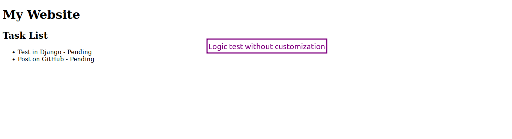

# To-Do List using Django 
- O ```Django``` por si só é poderoso para criar grandes estruturas e complexas aplicações web. 

- Porém, talvez, não seja o melhor ponto de partida você desenvolver uma __aplicação grande__ e complexa sem antes ter boas bases de como funciona esse Framework. 

- a forma como aprendi esse maravilhoso e poderoso framework foi construindo algo que está tão perto de nós que não existiria uma forma melhor de praticar se não fosse com ele. Um To-Do list. 



## Construindo o App
- Tenha o Django em seu sistema antes de começar a aplicação: 

```sh
pip install django
```

- Após isso vocẽ pode começar os trabalhos com alguns comando que são default do Django: 

```python
django-admin startproject todo_project
```

- Esse comando irá criar toda a estrutura necessária para você construir seu app, mas ainda há alguns outros comandos necessários: 

```python
python3 manage.py startapp todo_app
```

- Este comando de fato criará seu App. Mas, o django necessita que você faça algumas migrações, principalmente para poder trabalhar com Banco de dados. 

```python
python manage.py makemigrations
python manage.py migrate
```